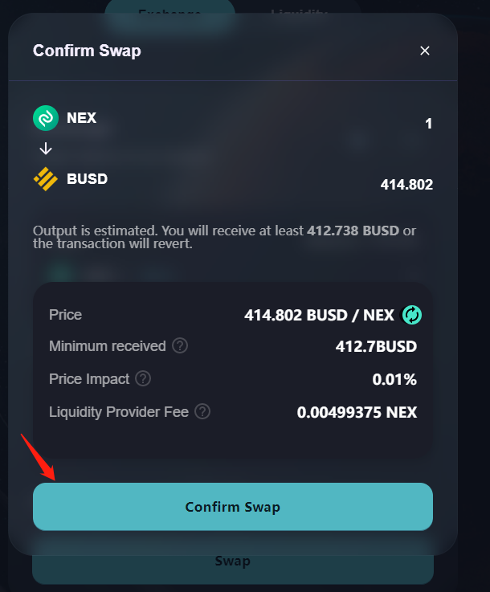

# 🔄 兌換

兌換產品使任意用戶只要錢包有幣，即可在NexusSwap上任意幣對的幣幣交易，完全去中心化，代幣都在您的錢包地址中，安全可靠；

### 操作步驟

#### 1、點擊【連接錢包】按鈕，彈出連接錢包彈窗，選擇MetaMask錢包進行連接，錢包正確連接後，即可進行兌換操作，無需註冊。

.png>)

#### 2、在頁面中，選擇兌換產品，選擇想要兌換的幣對，輸入正確有效的數量，點擊【交換】按鈕

.png>)

#### 3、在兌換確認兌換中，點擊【確認交換】按鈕，彈出錢包應用的交易確認彈窗，點擊【確認】按鈕，確認交易；

#### 4、錢包確認後，等待區塊確認。 頁面彈窗中，點擊【View on NEXUSscan】按鈕，可在區塊瀏覽器中，查看交易詳情；也可將新兌換的代幣，添加到錢包應用中。

.png>)

#### 5、區塊確認完成後，頁面右上角彈出交易收據小彈窗，即代表已兌換成功，點擊彈窗中“View on NEXUSscan”，打開新窗口跳轉區塊鏈瀏覽器頁面，查看該兌換操作的交易詳情。

