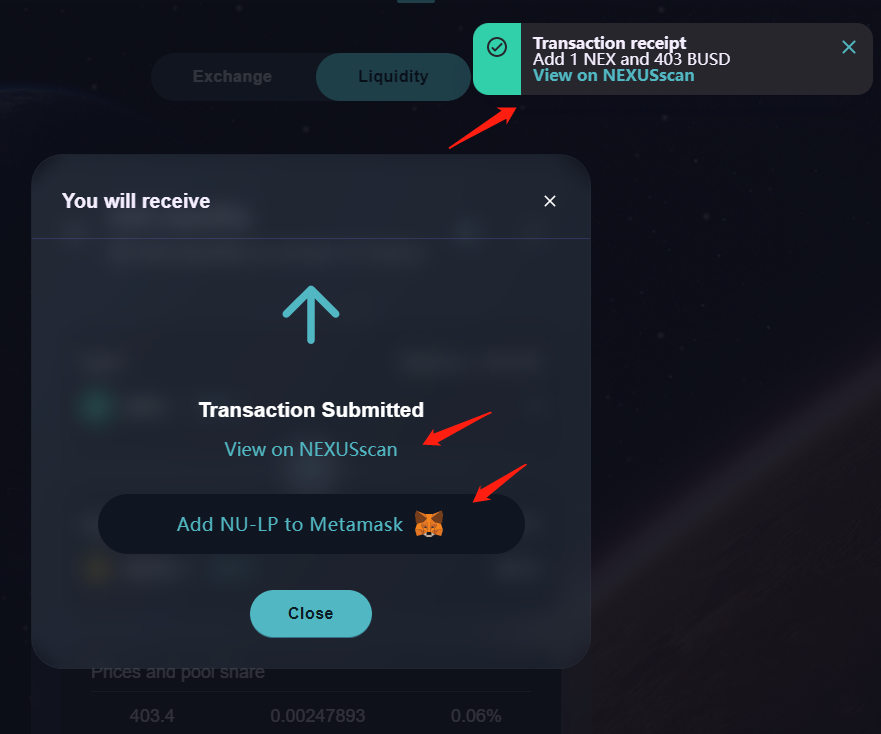

# ➕ 添加流動性

​供應幣對，新增流動性，獲得對應流動性代幣，為兌換產品提供流動性資金池。 流動性代幣，不僅可以獲得兌換功能所產生的手續費，還可參與流動性挖礦--農場和糖漿池。

#### 1、錢包正確連接後，進入流動性產品頁面，點擊【新增流動性】按鈕；

#### 2、在新增流動性頁面，選擇幣對和代幣數量，點擊【供應】按鈕。

.png>)

#### 3、在新增流動性確認彈窗中，點擊【確認供應】按鈕，確認交易，彈出錢包應用中的交易確認彈窗，點擊【確認】按鈕，合約執行交易，區塊進行確認；

.png>)

#### 4、區塊確認完成後，頁面右上角彈出交易收據小彈窗，即代表已添加流動性成功。 扣除對應數量的2種代幣，獲得對應的流動性代幣。 點擊彈窗中“View on NEXUSscan”，打開新窗口跳轉區塊鏈瀏覽器頁面，查看該兌換操作的交易詳情。

