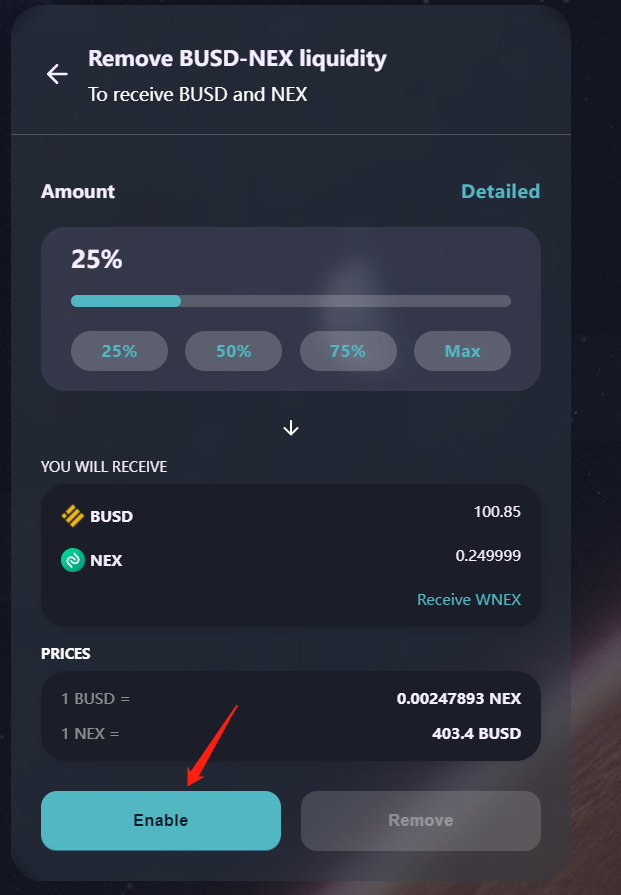
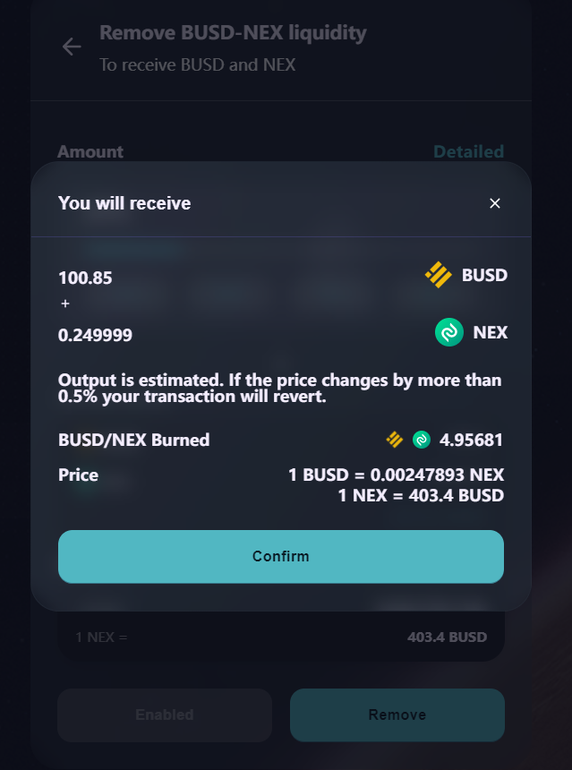
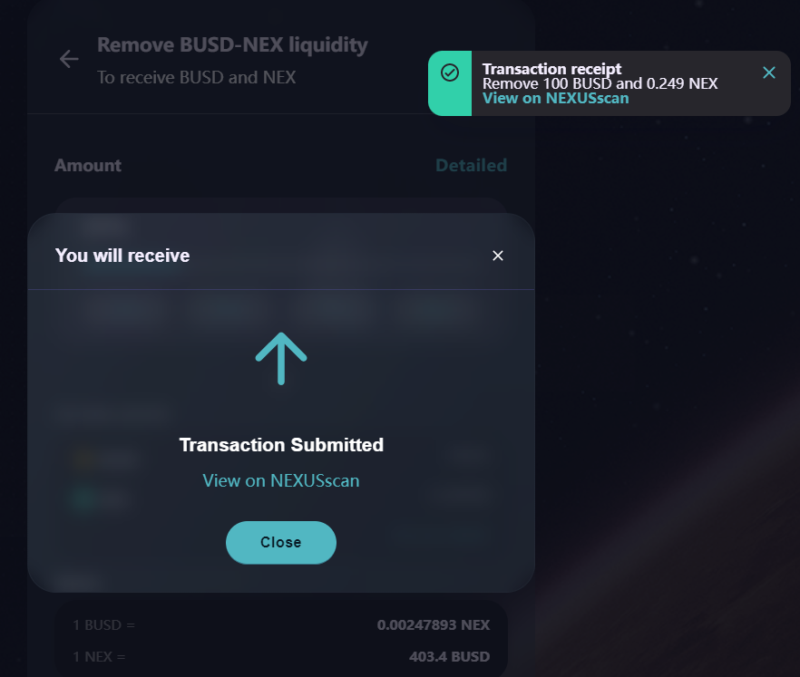

# ➖ 移除流動性

添加流動性後，獲得流動性代幣，流動性代幣，可進行移除，換回對應的2種代幣。

#### 1、錢包正確連接後，進入流動性產品頁面，您可看到連接錢包已有的流動性代幣情况。 點擊查看代幣先去，點擊【新增流動性】按鈕，進入移除流動性操作。

.png>)

#### 2、在流動性移除確認彈窗中，輸入要移除的流動性代幣數量，點擊【啟用】按鈕，進行錢包簽名。

#### 3、錢包簽名後，【移除】按鈕啟動，點擊【移除】按鈕，進行移除交易確認，確認後，彈出錢包應用的交易確認，點擊【確認】按鈕，交易執行，區塊進行確認；

#### 4、區塊確認完成後，頁面右上角彈出交易收據小彈窗，即代表移除流動性成功。 扣除對應數量的流動性代幣，獲得對應數量的2種代幣，點擊彈窗中“View on NEXUSscan”，打開新窗口跳轉區塊鏈瀏覽器頁面，查看該兌換操作的交易詳情。

