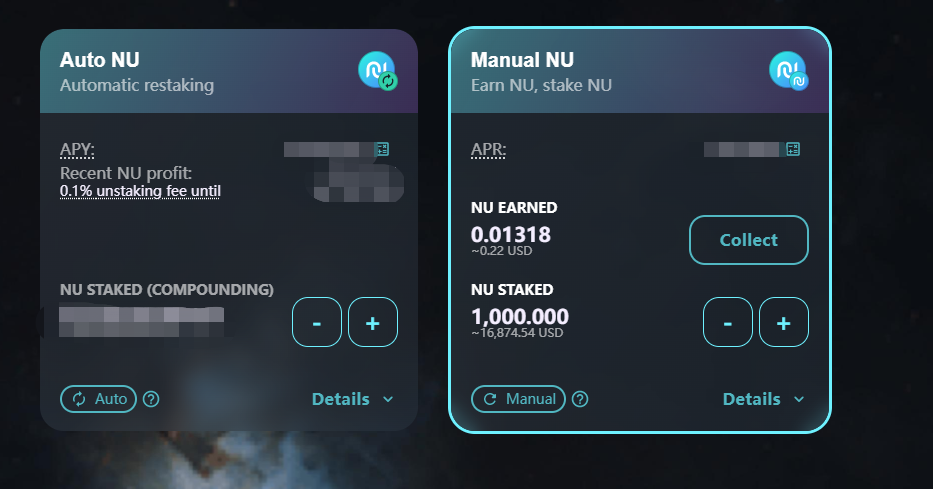
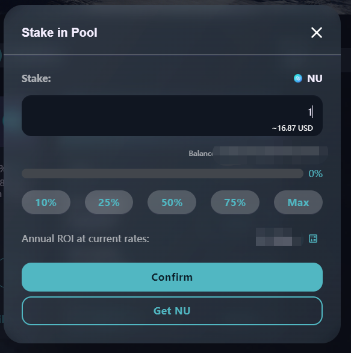
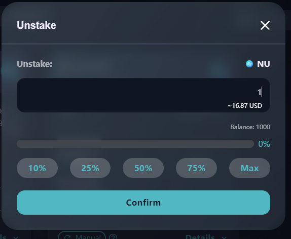

# 🌋 糖漿池

### 什麼是糖漿池？

糖漿池是在NexusSwap上賺取免費代幣最簡單的方法。 質押NU，賺取免費代幣！ 就是這麼簡單。

另外，還有一些特殊的糖漿池，讓你質押除了NU之外的其他代幣！

### 如何在糖漿池中質押？

在糖漿池中質押，讓你在睡覺時亦可賺取NU或其他代幣！

這比在NexusSwap農場中進行流動性挖礦要簡單。 有別於農場，你只需要質押一種代幣即可開始賺取：通常是NU。

#### 1、錢包正確連接後，進入糖漿池產品頁面，選擇一個您希望質押的糖漿池。

.png>)

1、**自動 NU** 自動複投您的收益：任何賺取到的NU，將被自動收穫並重新投入回該糖漿池中。 即收益在無時無刻被轉化為本金，助您產生更多收益。

2、**手動 NU** 與自動NU不同，該池不會自動幫您複投收益。 您需要手動收穫，並手動複投您的收益。

3、其他糖漿池讓您質押NU，來賺取一系列非常有意思的其他項目代幣。 請務必瞭解他們。

#### 2、選擇好您希望質押的糖漿池後，點擊啟用按鈕，並在錢包彈出的消息中確認。

.png>)

#### 3、稍等片刻，啟用按鈕將變成質押。 點擊它來打開質押選單。

.png>)

#### 4、輸入您要質押的數量，或直接選擇餘額的百分比來選擇。

.png>)

#### 5、點擊【確認】按鈕，彈出錢包應用中的交易確認彈窗，點擊【確認】按鈕，合約執行交易，區塊進行確認，確認後，可查看質押成功提示。

6、現在您應該能看到糖漿池的詳細質押資訊。 自動NU將展示一個倒數計時，用於提示「解除質押手續費」的收取還有多久結束。 其他糖漿池將顯示收穫按鈕，用於將賺取到的獎勵收穫至錢包內。

### 在糖漿池中添加或移除NU 

無論是在糖漿池中添加更多的NU，還是將NU選取並重新質押至更高利潤的糖漿池池中，都非常容易。 以下是操作指南：

1、點擊-（減號）來從池中選取NU，點擊+（加號）來添加更多的NU：

.png>)

**請注意：**若您質押的是自動NU糖漿池，在質押操作後的72小時內，選取需要收取0.1%的手續費。

2、頁面會彈出一個視窗，若您點擊的是+（加號），請在視窗中選擇您要添加的NU數量。若您點擊的是-（減號），則選擇您要選取的NU數量。

 

3、點擊**確認**。

4、稍等片刻，您的質押資訊將更新：\
.png>)\
**请注意：**無論是添加還是選取NU，都會自動將待收穫收益，收穫至您的錢包中。
